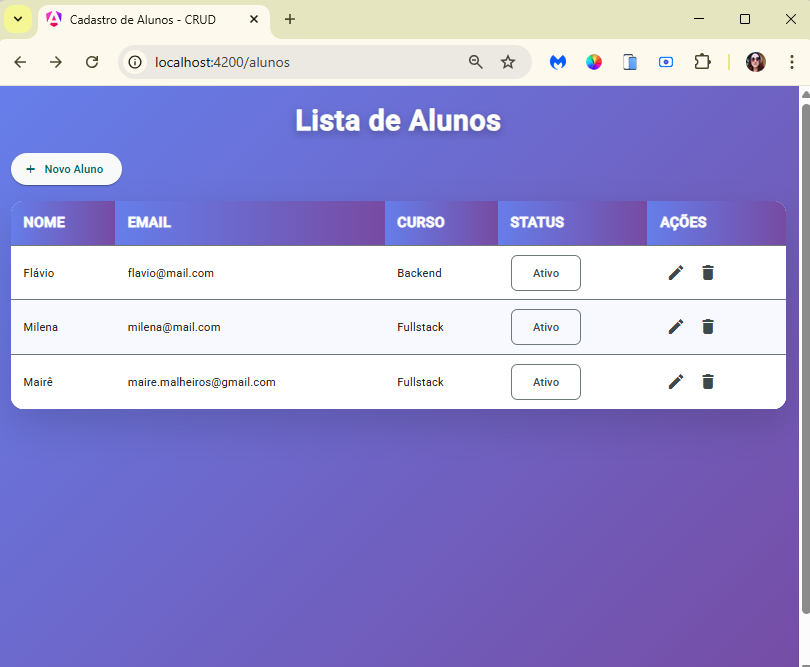
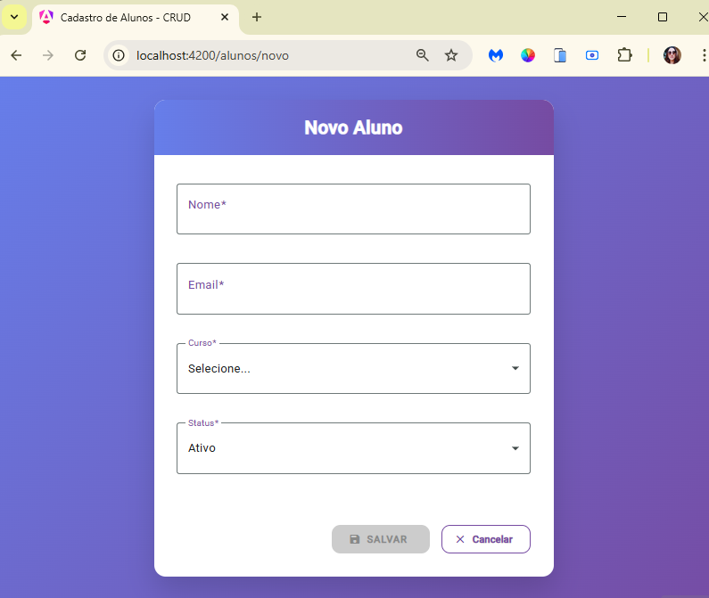
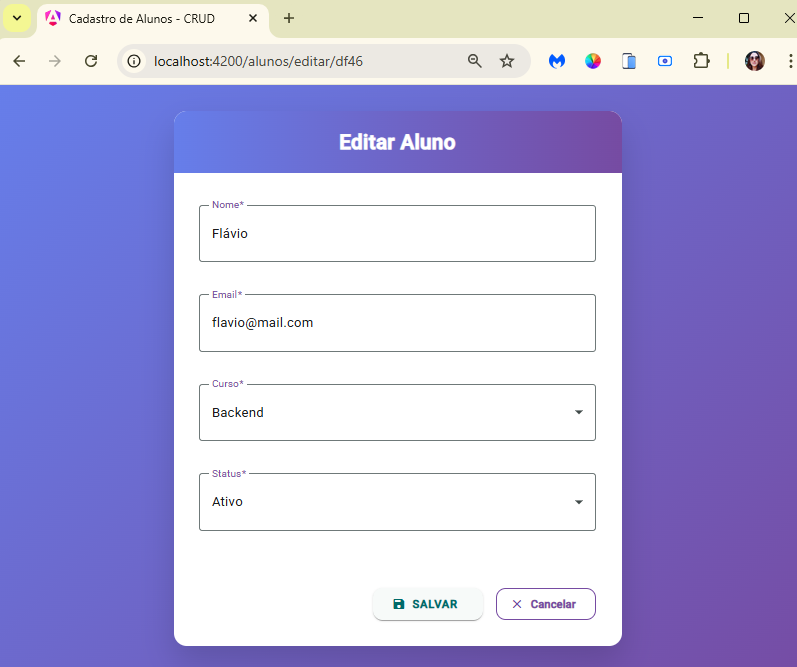

# Gestão de Alunos — CRUD com Angular 17 + Material Design


CRUD completo, moderno e 100% funcional para gerenciamento de alunos, desenvolvido do zero com as melhores práticas atuais do Angular.

## Preview

| Lista de Alunos                         | Novo Aluno                              | Editar Aluno                            |
|-----------------------------------------|-----------------------------------------|-----------------------------------------|
|  |  |  |

## Funcionalidades

- Listagem com tabela responsiva e chips de status  
- Cadastro, edição e exclusão de alunos  
- Validação completa com Reactive Forms  
- Feedback visual com SnackBar personalizado  
- Design premium com gradientes, animações e totalmente responsivo  
- API mock com JSON Server

## Tecnologias

- Angular (Standalone Components)
- Angular Material
- Reactive Forms + Validators
- TypeScript com tipagem forte
- SCSS personalizado
- JSON Server

## Como executar

```bash
# 1. Clone o repositório
git clone https://github.com/SEU-USUARIO/angular-crud.git

# 2. Entre na pasta
cd angular-crud

# 3. Instale as dependências
npm install

# 4. Crie o banco de dados a partir do exemplo
cp db-example.json db.json

# 5. Inicie o JSON Server (em outro terminal)
npx json-server --watch db.json --port 3000

# 6. Execute o Angular
ng serve

```
Acesse → [http://localhost:4200](http://localhost:4200)

## Próximos passos (já mapeados)

- Filtro e busca na listagem  
- Paginação na tabela  
- Exportação para PDF/Excel  
- Autenticação com JWT  
---
Se curtiu o projeto, deixa uma ⭐!

Qualquer dúvida ou sugestão, é só abrir uma issue ou me chamar no LinkedIn.  

